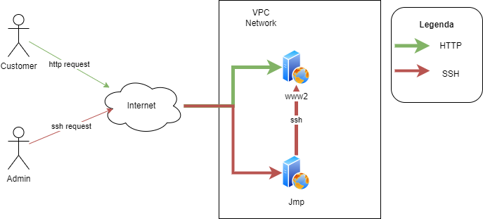

## Task

You and John have joined a new project. Your job is to use Terraform to write code for IaC.
The Client wants to have infrastructure with a WWW (nginx) server hosting the company's webpage.
Admin access has to be secured with a Bastion host.
Bastion host is accessed from selected IP addresses using SSH.
The project seems simple and you and John have dedicated a month to finish it.
Unfortunately in the first week you catch COVID-19 and your colleague has to work alone.
When you return to work after 10 days, there is some good news and some bad news.
Good news is that a large part of the code has already been written by John.
Bad news is that John is now also sick and you have to finish the project and present it to the Client.
You only have 5 days to do it.

## Instructions

This used to be working deployment of a very simple nginx-powered static site.
Normally to deploy it, you would need:
- Terraform installed on your computer (tested on v1.3.1)
- GCP project, assumption is you are the owner of the project and can grant yourself all priviliges
- [gcloud installed (to authenticate)](https://registry.terraform.io/providers/hashicorp/google/latest/docs/guides/provider_reference)
- SSH key pair for VM access
- Provide all of the variable values as defined in variables.tf (you can put them into terraform.tfvars)
- Run: terraform init, plan, apply

If deployment completes successfully, you should be able to reach your VM in web browser: http://your-vm-public-ip-addr/
You should also be able to ssh into it.

Current code is broken and you will need to fix it to actually get a static page displayed. Good luck!
